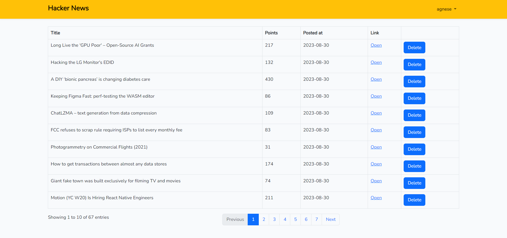

# Hacker News Scraper

Welcome to the Hacker News Scraper! This application scrapes data from the Hacker News website and provides a frontend interface to view and manage the scraped news articles.

## Features

- Scrapes data from Hacker News (title, link, points, date created)
- Stores scraped data in a local database
- Updates points for each article on subsequent scrapes
- Frontend interface using Vue.js to display and manage news articles
- User authentication with username/password

## Prerequisites

Before you begin, ensure you have the following installed:

- PHP (>= 7.4)
- Composer
- Node.js
- Laravel 8

## Installation

1. Clone the repository:
   ```
   git clone https://github.com/agnesgab/hacker-news.git
   cd hacker-news-scraper
   ```

2. Install PHP dependencies:
   ```
   composer install
   ```

3. Install Node.js dependencies:
   ```
   npm install
   ```

4. Copy the `.env.example` file to `.env`:
   ```
   cp .env.example .env
   ```

5. Generate an application key:
   ```
   php artisan key:generate
   ```

6. Configure your database settings in the `.env` file.
   ```
   DB_CONNECTION=mysql
   DB_HOST=127.0.0.1
   DB_PORT=3306
   DB_DATABASE=your_database_name
   DB_USERNAME=your_database_username
   DB_PASSWORD=your_database_password
   ```

7. Run database migrations:
   ```
   php artisan migrate
   ```

## Usage

1. Run scheduled tasks to fetch data from Hacker News every minute:
   ```
   php artisan schedule:work
   ```

2. Start the Laravel development server:
   ```
   php artisan serve
   ```

3. Compile Vue.js assets:
   ```
   npm run dev
   ```

4. Access the application in your web browser locally.

## Packages

Packages used in this project:
- Guzzle (https://docs.guzzlephp.org/en/stable/)
- DOM Crawler (https://symfony.com/doc/current/components/dom_crawler.html)
- Laravel UI (https://github.com/laravel/ui)
- DataTables (https://datatables.net/)

## Testing

For running unit tests use:
```
php artisan test
```

Sincerely, Agnese :relaxed:

 
